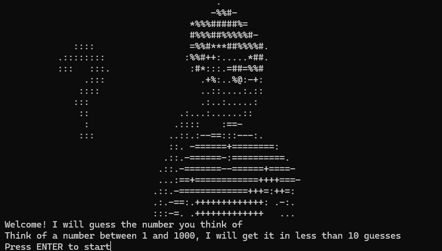

# High-Low Number Guessing Game

This is a simple Python console game where the computer guesses the number you think of using the principles of binary search. The program guarantees to find your number in **10 guesses or fewer**. 

## How It Works
1. Think of a number between 1 and 1000 (or any defined range).
2. The program will make a guess and ask if it should go higher (`H`), lower (`L`), or if it guessed correctly (`C`).
3. The game ends when the correct number is guessed or if you break the rules!

## Features
- Interactive and intuitive gameplay.
- Displays an ASCII art splash screen at the start of the game.
- Implements binary search to efficiently guess the number.

## Getting Started
1. Clone the repository:
   ```bash
   git clone https://github.com/maxshabs/high-low-game.git
2. Run the script:
   ```bash
   python high_low_game.py

## Screenshots
### Start Menu

### Winning Screen

